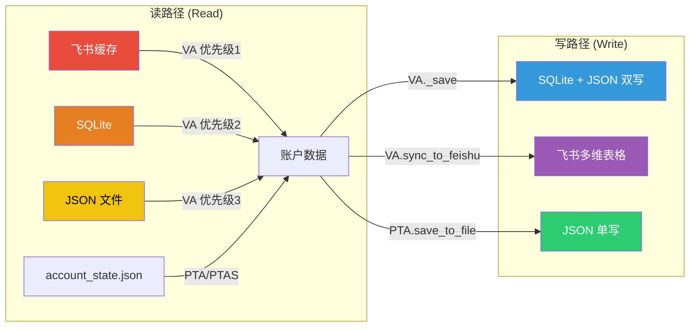
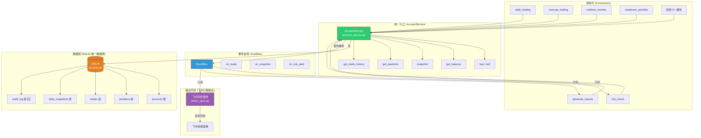
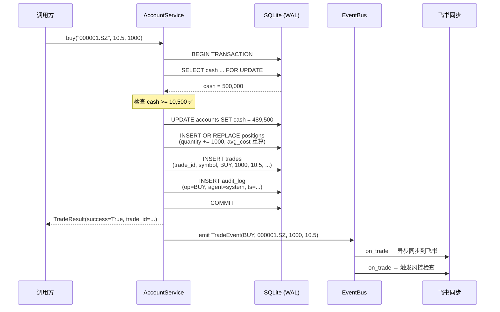
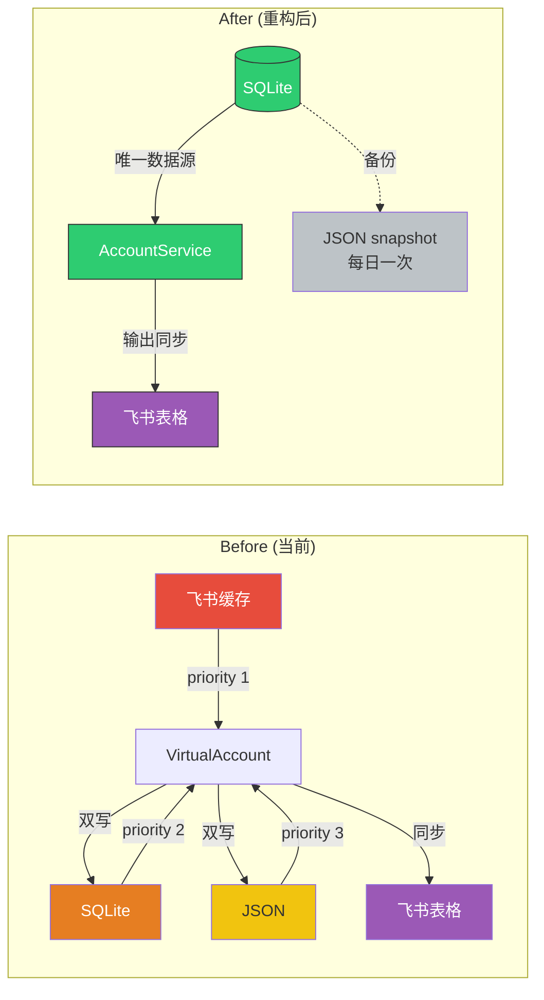
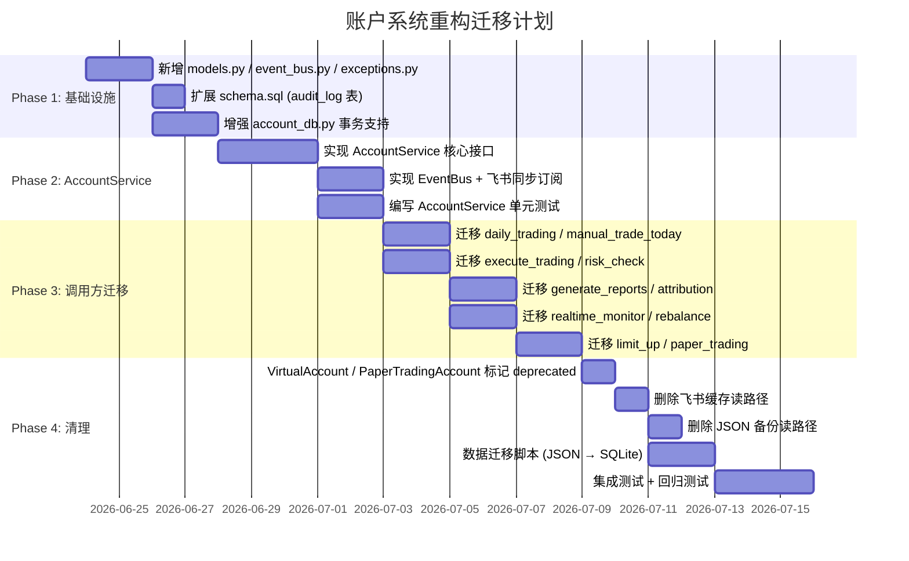

# 账户系统重构调研报告

> **调研日期**: 2026-06-23
> **调研范围**: 账户管理、持仓管理、交易流水、数据同步
> **目标**: 识别现状问题，设计统一账户服务架构

---

## 一、现状分析

### 1.1 当前架构全景

```mermaid
graph TB
    subgraph "调用方 (Consumers)"
        DT[daily_trading.py]
        DTF[daily_trading_fixed.py]
        MT[manual_trade_today.py]
        ET[execute_trading.py]
        RC[risk_check.py]
        GR[generate_reports.py]
        CA[comprehensive_attribution.py]
        PA[performance_attribution.py]
        LUS[limit_up_strategy_runner.py]
        LL1[limit_up_leaders_20260415.py]
        LL2[limit_up_leaders_20260416.py]
        MPU[daily_portfolio_update.py]
        MPD[paper_trading_demo.py]
        MN[main.py]
        ATF[advanced_trading_features.py]
        RM[realtime_monitor.py]
        BP[rebalance_portfolio.py]
        ES[execute_stock_selection.py]
        SIM[simulated_trading.py]
    end

    subgraph "账户实现 (3 套并存)"
        VA[VirtualAccount<br/>virtual_account.py]
        PTA[PaperTradingAccount<br/>paper_trading.py]
        PTAS[PaperTradingAccount<br/>paper_trading_system.py]
        FVA[FeishuVirtualAccount<br/>execute_trading.py:117]
        DVA[DebugVirtualAccount<br/>debug_virtual_account.py]
    end

    subgraph "数据层 (3 源并存)"
        FS[飞书缓存<br/>feishu_cache/*.json]
        SQL[SQLite<br/>account.db]
        JSON[本地 JSON<br/>virtual_account.json<br/>trade_log.json]
        JSON2[account_state.json]
    end

    subgraph "外部"
        FT[飞书多维表格]
        SYNC[process_feishu_sync_qtrade.py<br/>sync_to_feishu.py]
    end

    DT & DTF & MT & RC & GR & CA & PA & LUS & LL1 & LL2 --> VA
    ET --> FVA
    MPU --> PTA
    MPD & MN --> PTA
    ATF --> PTAS

    VA -->|优先级1| FS
    VA -->|优先级2| SQL
    VA -->|优先级3| JSON
    VA -->|sync| FT
    SYNC --> FT

    FVA --> FS
    PTA --> JSON2
    PTAS --> JSON2

    style VA fill:#f66,stroke:#333,color:#fff
    style PTA fill:#f66,stroke:#333,color:#fff
    style PTAS fill:#f66,stroke:#333,color:#fff
    style FVA fill:#f66,stroke:#333,color:#fff
    style FS fill:#f96,stroke:#333
    style SQL fill:#f96,stroke:#333
    style JSON fill:#f96,stroke:#333
    style JSON2 fill:#f96,stroke:#333
```



### 1.2 账户实现清单

| 实现 | 文件 | 行数 | 用途 | 数据源 |
|------|------|------|------|--------|
| **VirtualAccount** | `virtual_account.py` | 405 | 主力账户，被 11+ 模块调用 | 飞书缓存 → SQLite → JSON (3 级 fallback) |
| **PaperTradingAccount** | `paper_trading.py` | 540 | 模拟交易 demo | JSON (`account_state.json`) |
| **PaperTradingAccount** | `paper_trading_system.py` | ~400 | 另一套模拟交易（同名类） | JSON (`account_state.json`) |
| **FeishuVirtualAccount** | `execute_trading.py:117` | ~100 | execute_trading 专用 | 飞书缓存直接读取 |
| **DebugVirtualAccount** | `debug_virtual_account.py` | ~80 | 调试用 | 硬编码 `debug_positions.json` |

### 1.3 数据源分布



### 1.4 Balance 计算散落点

Balance 计算逻辑在 **至少 7 处** 独立实现：

| 位置 | 计算方式 | 问题 |
|------|----------|------|
| `VirtualAccount.get_total_asset()` | cash + position_value | 持仓市值用 cost 近似，非实时市价 |
| `VirtualAccount.get_position_value()` | 三种格式 fallback (market_value / cost / volume*cost_price) | 用成本代替市值，逻辑混乱 |
| `TradingAccount.get_total_assets()` | cash + sum(market_value) | SQLite 中 market_value 可能过期 |
| `PaperTradingAccount.get_portfolio_value()` | cash + sum(volume * current_price) | 依赖 CSV 价格数据 |
| `realtime_monitor.py:289` | `cash + sum(p.market_value)` | 独立计算，不经过账户类 |
| `rebalance_portfolio.py:106` | `cash + sum(p.market_value)` | 又一份独立实现 |
| `execute_stock_selection.py:199` | `remaining_cash + invested` | 第四份独立实现 |

---

## 二、问题清单

### P0 — 数据一致性风险

| # | 问题 | 严重程度 | 影响 |
|---|------|----------|------|
| 1 | **双写无事务**: `VirtualAccount._save()` 先写 SQLite 再写 JSON，两步非原子 | 🔴 Critical | SQLite 写入成功但 JSON 失败时，下次读取优先级链可能导致数据回退 |
| 2 | **优先级链导致数据跳变**: 飞书缓存 > SQLite > JSON，但飞书缓存有 1 小时过期逻辑 | 🔴 Critical | 缓存过期瞬间，读到 SQLite 的旧数据，资产值可能跳变 |
| 3 | **buy/sell 非线程安全**: 内存中修改 `account_data["current_cash"]` 后才 `_save()` | 🔴 Critical | 多进程并发时，两个 buy 可能读到同一 cash 值，都通过检查 |
| 4 | **sell 的持仓检查与 trade_log 不一致**: `get_positions()` 从飞书缓存读，但 sell 后写入 trade_log | 🟠 High | 飞书缓存有持仓但 SQLite 无对应记录，卖出后 SQLite 持仓不更新 |

### P1 — 架构分裂

| # | 问题 | 严重程度 | 影响 |
|---|------|----------|------|
| 5 | **3 套账户实现并存**: VirtualAccount / PaperTradingAccount(x2) / FeishuVirtualAccount / DebugVirtualAccount | 🟠 High | 同一概念有 5 种实现，新人不知用哪个 |
| 6 | **同名类 PaperTradingAccount**: 分别在 `paper_trading.py` 和 `paper_trading_system.py` | 🟠 High | import 歧义，`daily_portfolio_update.py` 从 `paper_trading_system` 导入 |
| 7 | **Balance 计算 7 处独立实现**: 每个模块自己算 total_assets | 🟡 Medium | 改一处忘改其他处，报告数字不一致 |
| 8 | **VirtualAccount.get_position_value() 用 cost 代替 market_value**: 三种格式 fallback | 🟡 Medium | 持仓市值永远是成本价，非真实市值 |

### P2 — 可维护性

| # | 问题 | 严重程度 | 影响 |
|---|------|----------|------|
| 9 | **sys.path.insert 硬编码**: `virtual_account.py:25` 和 `sync_to_feishu.py:360` | 🟡 Medium | 部署路径变动即崩溃 |
| 10 | **飞书 API Token 硬编码**: `virtual_account.py:34-37` | 🟡 Medium | 安全风险，Token 泄露 |
| 11 | **无事件通知**: 交易发生后无回调机制 | 🟡 Medium | 风控检查、报表生成靠轮询或手动触发 |
| 12 | **无审计日志**: trade_log 只记录买卖，不记录操作人、操作来源 | 🟢 Low | 无法追溯问题来源 |

---

## 三、新架构设计

### 3.1 总体架构



### 3.2 AccountService 核心接口

```python
# accounts/account_service.py

class AccountService:
    """账户系统统一入口

    设计原则:
    1. SQLite 唯一数据源 (Single Source of Truth)
    2. 所有 buy/sell 操作在事务内完成 (Atomic)
    3. 飞书只做输出同步，不参与读路径 (Output Only)
    4. 每次交易发布事件，解耦通知 (Event-Driven)
    """

    def __init__(self, account_id: str, event_bus: EventBus = None):
        self.db = get_db()
        self.account_id = account_id
        self.event_bus = event_bus or EventBus()

    # ── 交易操作 (事务保证) ─────────────────────────────

    def buy(self, symbol: str, name: str, price: float, quantity: int,
            reason: str = "", agent_id: str = "system") -> TradeResult:
        """买入 — cash 扣减 + position 更新 + trade 记录 原子完成"""
        # 全部在 SQLite 事务内:
        # 1. SELECT cash FROM accounts WHERE account_id = ? FOR UPDATE
        # 2. 检查 cash >= price * quantity
        # 3. UPDATE accounts SET cash = cash - amount
        # 4. INSERT/UPDATE positions (upsert)
        # 5. INSERT trades
        # 6. INSERT audit_log
        # 7. COMMIT
        # 8. event_bus.emit(TradeEvent(...))

    def sell(self, symbol: str, price: float, quantity: int,
             reason: str = "", agent_id: str = "system") -> TradeResult:
        """卖出 — cash 增加 + position 扣减 + trade 记录 原子完成"""

    # ── 查询操作 (只读) ─────────────────────────────────

    def get_balance(self) -> Balance:
        """统一余额计算: cash + sum(quantity * current_price)"""
        # current_price 从行情缓存获取，非持仓成本价

    def get_positions(self) -> List[Position]:
        """从 SQLite 读取，无 fallback 链"""

    def get_trade_history(self, start_date=None, end_date=None) -> List[Trade]:
        """从 trades 表读取"""

    def snapshot(self, trade_date: str = None) -> Snapshot:
        """生成并保存每日快照"""

    # ── 同步操作 (异步) ─────────────────────────────────

    def sync_to_feishu(self) -> bool:
        """将 SQLite 数据同步到飞书，失败不影响主流程"""
```

### 3.3 事务保证



### 3.4 数据源优先级简化



### 3.5 EventBus 设计

```python
# accounts/event_bus.py

class EventType(Enum):
    TRADE_EXECUTED = "trade_executed"      # 交易执行
    BALANCE_CHANGED = "balance_changed"    # 余额变动
    SNAPSHOT_CREATED = "snapshot_created"  # 快照生成
    RISK_ALERT = "risk_alert"             # 风控告警
    FEISHU_SYNC_REQUESTED = "feishu_sync" # 飞书同步请求

@dataclass
class TradeEvent:
    type: EventType
    account_id: str
    symbol: str
    direction: str  # BUY / SELL
    price: float
    quantity: int
    amount: float
    timestamp: str
    agent_id: str

class EventBus:
    """进程内事件总线 (可升级为 Redis Pub/Sub)"""

    def __init__(self):
        self._handlers: Dict[EventType, List[Callable]] = {}

    def subscribe(self, event_type: EventType, handler: Callable):
        self._handlers.setdefault(event_type, []).append(handler)

    def emit(self, event: TradeEvent):
        for handler in self._handlers.get(event.type, []):
            try:
                handler(event)
            except Exception as e:
                logger.error(f"Event handler failed: {e}")
```

### 3.6 Schema 扩展

在现有 `accounts/schema.sql` 基础上新增：

```sql
-- 🆕 审计日志表
CREATE TABLE IF NOT EXISTS audit_log (
    id              INTEGER PRIMARY KEY AUTOINCREMENT,
    account_id      TEXT NOT NULL REFERENCES accounts(account_id),
    operation       TEXT NOT NULL,  -- BUY, SELL, SYNC, SNAPSHOT, ADJUST
    symbol          TEXT,
    quantity        REAL,
    price           REAL,
    amount          REAL,
    cash_before     REAL,
    cash_after      REAL,
    agent_id        TEXT DEFAULT 'system',
    source_module   TEXT,           -- 调用方模块名
    details         TEXT,           -- JSON 扩展字段
    created_at      TEXT DEFAULT (datetime('now'))
);

CREATE INDEX IF NOT EXISTS idx_audit_account_date
    ON audit_log(account_id, created_at);
```

### 3.7 文件目录规划

```
accounts/
├── __init__.py
├── schema.sql              # 数据库 Schema (现有 + audit_log)
├── account_db.py           # SQLite DAL 层 (现有, 增强事务支持)
├── account_service.py      # 🆕 统一入口 AccountService
├── event_bus.py            # 🆕 事件总线
├── models.py               # 🆕 统一数据模型 (Balance, Position, Trade, ...)
├── feishu_sync.py          # 🆕 飞书输出同步服务 (从 virtual_account.py 抽出)
└── exceptions.py           # 🆕 统一异常定义

examples/alpha_research/
├── virtual_account.py      # 标记为 deprecated, 转发到 AccountService
├── paper_trading.py        # 标记为 deprecated, 转发到 AccountService
└── ...
```

---

## 四、迁移方案

### 4.1 迁移步骤



### 4.2 Phase 1 — 基础设施 (3 天)

1. **创建 `accounts/models.py`** — 统一数据模型
   ```python
   @dataclass
   class Balance:
       cash: float
       market_value: float
       total_assets: float
       unrealized_pnl: float
       realized_pnl: float

   @dataclass
   class Position:
       symbol: str
       name: str
       quantity: int
       avg_cost: float
       current_price: float
       market_value: float
       unrealized_pnl: float
   ```

2. **创建 `accounts/event_bus.py`** — 进程内事件总线

3. **扩展 `accounts/schema.sql`** — 新增 `audit_log` 表

4. **增强 `accounts/account_db.py`** — 事务封装
   ```python
   def execute_transaction(self, operations: List[Callable]) -> bool:
       """在单个事务内执行多个操作"""
   ```

### 4.3 Phase 2 — AccountService 实现 (5 天)

1. **实现 `accounts/account_service.py`** — 核心接口
   - `buy()` / `sell()` — SQLite 事务内原子操作
   - `get_balance()` — 统一余额计算
   - `get_positions()` — SQLite 唯一数据源
   - `snapshot()` — 每日快照

2. **实现飞书同步服务** — `accounts/feishu_sync.py`
   - 订阅 EventBus 的 `TRADE_EXECUTED` 事件
   - 异步同步到飞书，失败仅记录日志

3. **单元测试** — 覆盖：
   - 事务原子性（模拟并发 buy/sell）
   - Balance 计算正确性
   - 事件发布/订阅
   - 飞书同步失败不影响主流程

### 4.4 Phase 3 — 调用方迁移 (10 天)

按调用方重要程度分批迁移：

**批次 1** — 核心交易模块（4 个文件）:
- `daily_trading.py` → `AccountService`
- `daily_trading_fixed.py` → `AccountService`
- `manual_trade_today.py` → `AccountService`
- `execute_trading.py` → `AccountService` (替换 FeishuVirtualAccount)

**批次 2** — 分析/报告模块（4 个文件）:
- `risk_check.py` → `AccountService.get_balance()`
- `generate_reports.py` → `AccountService`
- `comprehensive_attribution.py` → `AccountService`
- `performance_attribution.py` → `AccountService`

**批次 3** — 监控/调仓模块（3 个文件）:
- `realtime_monitor.py` → `AccountService.get_balance()`
- `rebalance_portfolio.py` → `AccountService`
- `execute_stock_selection.py` → `AccountService`

**批次 4** — 其他模块:
- `limit_up_strategy_runner.py`
- `limit_up_leaders_20260415.py` / `20260416.py`
- `daily_portfolio_update.py`
- `paper_trading_demo.py` / `main.py`
- `advanced_trading_features.py`
- `simulated_trading.py`

### 4.5 Phase 4 — 清理 (5 天)

1. **标记 deprecated**:
   ```python
   # virtual_account.py
   import warnings
   warnings.warn(
       "VirtualAccount is deprecated, use accounts.account_service.AccountService",
       DeprecationWarning, stacklevel=2
   )
   ```

2. **数据迁移脚本**: `scripts/migrate_account_data.py`
   - 读取 `data/virtual_account.json` → 写入 SQLite
   - 读取 `data/trade_log.json` → 写入 SQLite `trades` 表
   - 读取 `paper_trading_demo/account_state.json` → 写入 SQLite

3. **删除飞书缓存读路径**: 飞书仅作为输出目标

---

## 五、风险评估

### 5.1 迁移风险

| 风险 | 概率 | 影响 | 缓解措施 |
|------|------|------|----------|
| 数据丢失：JSON → SQLite 迁移时字段不匹配 | 🟡 中 | 🔴 高 | 迁移前做完整备份；迁移后对比校验 |
| 调用方遗漏：15+ 个模块未全部迁移 | 🟡 中 | 🟡 中 | 用 grep 扫描所有 import，建立 checklist |
| 飞书同步失败：新架构下飞书数据不及时 | 🟢 低 | 🟢 低 | 飞书仅作展示，不影响交易决策 |
| 并发问题：迁移期间新旧系统并存 | 🟡 中 | 🔴 高 | Phase 3 期间保持 VirtualAccount 可写，但读路径切换到 AccountService |
| 回滚困难：迁移后发现问题需回退 | 🟢 低 | 🟡 中 | SQLite 数据可随时导出为 JSON，快速回退 |

### 5.2 技术风险

| 风险 | 概率 | 影响 | 缓解措施 |
|------|------|------|----------|
| SQLite WAL 并发瓶颈 | 🟢 低 | 🟢 低 | 当前单进程 cron 场景足够；未来可升级到 PostgreSQL |
| EventBus 内存泄漏 | 🟢 低 | 🟢 低 | 限制 handler 数量；使用 weakref |
| audit_log 表膨胀 | 🟢 低 | 🟢 低 | 按季度归档旧记录 |

### 5.3 业务风险

| 风险 | 概率 | 影响 | 缓解措施 |
|------|------|------|----------|
| 交易中断：迁移期间 buy/sell 失败 | 🟡 中 | 🔴 高 | 双写期间保持旧系统可回退 |
| 报表数字不一致：新旧系统计算口径不同 | 🟡 中 | 🟡 中 | 对比测试：同时用新旧系统计算，diff 应为 0 |

---

## 六、关键决策点

### 需要确认的决策

| # | 决策 | 选项 | 建议 |
|---|------|------|------|
| 1 | 飞书同步方式 | A) 同步写入 B) 异步事件驱动 | **B) 异步** — 飞书延迟不影响交易 |
| 2 | JSON 备份是否保留 | A) 完全删除 B) 每日快照 | **B) 每日快照** — 灾备用途 |
| 3 | PaperTradingAccount 是否合并 | A) 合并到 AccountService B) 独立保留 | **A) 合并** — 减少维护成本 |
| 4 | 飞书 Token 管理 | A) 环境变量 B) 配置文件 | **A) 环境变量** — 安全最佳实践 |
| 5 | EventBus 实现 | A) 进程内 B) Redis Pub/Sub | **A) 进程内** — 当前单进程够用 |

---

## 七、附录

### A. 调用方完整清单

| 模块 | 使用的账户类 | 操作 | 迁移优先级 |
|------|-------------|------|-----------|
| `daily_trading.py` | VirtualAccount | buy/sell | P0 |
| `daily_trading_fixed.py` | VirtualAccount | buy/sell | P0 |
| `manual_trade_today.py` | VirtualAccount | buy/sell | P0 |
| `execute_trading.py` | FeishuVirtualAccount | buy/sell | P0 |
| `risk_check.py` | VirtualAccount | read-only | P1 |
| `generate_reports.py` | VirtualAccount | read-only | P1 |
| `comprehensive_attribution.py` | VirtualAccount | read-only | P1 |
| `performance_attribution.py` | VirtualAccount | read-only | P1 |
| `realtime_monitor.py` | dict (自行计算) | read-only | P1 |
| `rebalance_portfolio.py` | dict (自行计算) | read-only | P1 |
| `limit_up_strategy_runner.py` | VirtualAccount | buy/sell | P2 |
| `limit_up_leaders_20260415.py` | VirtualAccount | read-only | P2 |
| `limit_up_leaders_20260416.py` | VirtualAccount | read-only | P2 |
| `daily_portfolio_update.py` | PaperTradingAccount | read-only | P2 |
| `paper_trading_demo.py` | PaperTradingAccount | buy/sell | P2 |
| `main.py` | PaperTradingAccount | buy/sell | P2 |
| `advanced_trading_features.py` | PaperTradingAccount (system) | buy/sell | P2 |
| `simulated_trading.py` | 自实现 | buy/sell | P3 |
| `execute_stock_selection.py` | dict (自行计算) | read-only | P3 |
| `debug_virtual_account.py` | DebugVirtualAccount | read-only | P3 |

### B. 数据源字段映射

| VirtualAccount 字段 | AccountDB 字段 | 飞书字段 | JSON 字段 |
|---------------------|---------------|----------|-----------|
| `account_data["account_id"]` | `accounts.account_id` | 账户 ID | `account_id` |
| `account_data["current_cash"]` | `accounts.cash` | 现金余额 | `current_cash` |
| `account_data["initial_capital"]` | `accounts.initial_capital` | 初始资金 | `initial_capital` |
| `account_data["account_name"]` | `accounts.account_name` | 账户名称 | `account_name` |
| `positions[].symbol` | `positions.symbol` | 股票代码 | `positions[].symbol` |
| `positions[].quantity` | `positions.quantity` | 持仓数量 | `positions[].quantity` |
| `positions[].avg_price` | `positions.avg_cost` | 平均成本 | `positions[].avg_price` |
| `positions[].cost` | `positions.market_value` | 持仓市值 | `positions[].cost` |

### C. 测试覆盖要求

| 测试类型 | 覆盖内容 | 用例数 |
|----------|----------|--------|
| 事务原子性 | buy/sell 并发执行，cash + position 一致性 | 5 |
| Balance 计算 | 空仓/满仓/部分持仓/含浮亏 | 8 |
| 事件发布 | 交易后 EventBus 收到正确事件 | 4 |
| 飞书同步 | 同步失败不抛出异常 | 3 |
| 数据迁移 | JSON → SQLite 字段完整迁移 | 6 |
| 兼容性 | 旧调用方通过 deprecated 层正常工作 | 10 |
