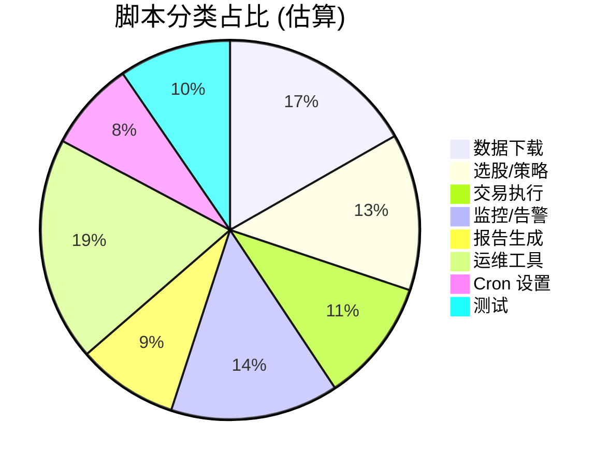
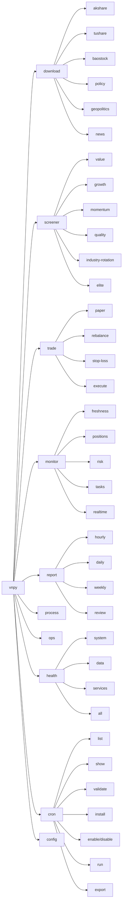
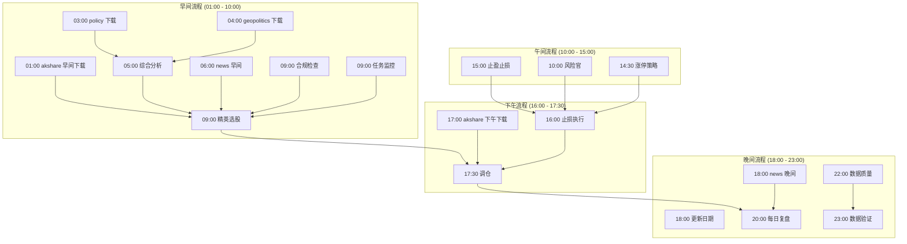
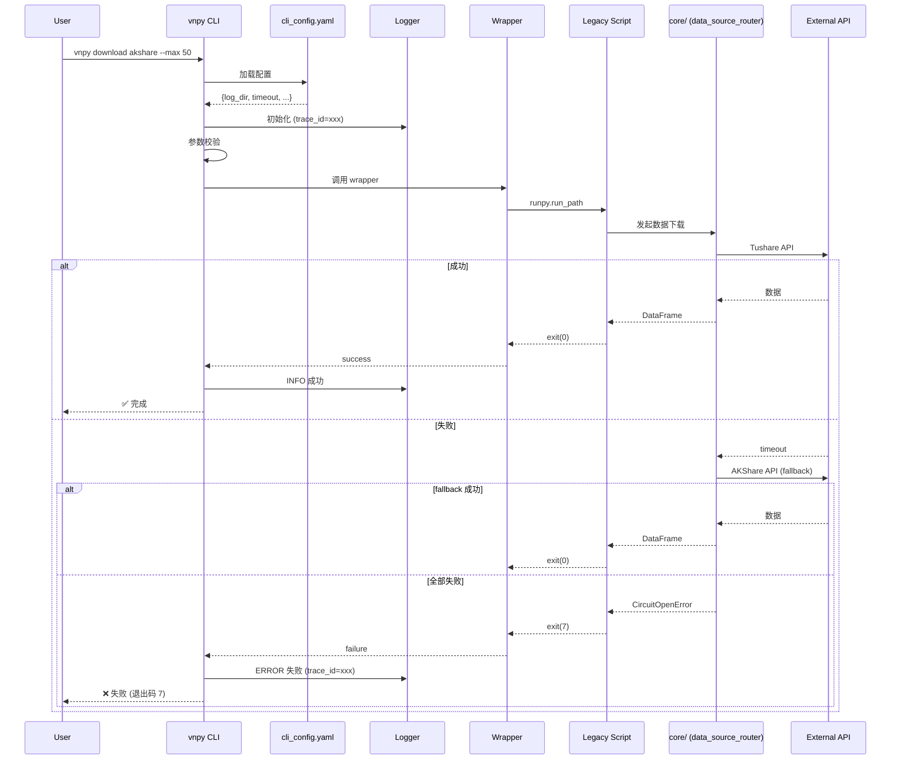
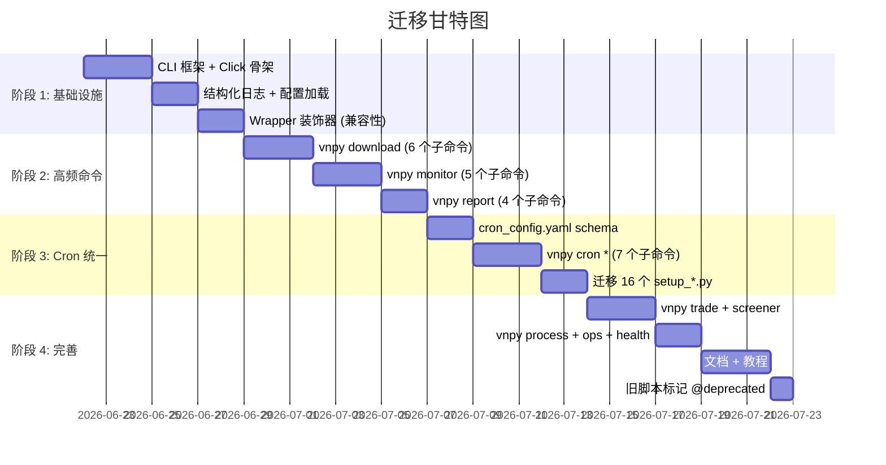

# VNPY 统一 CLI 与 Cron 架构设计

> **文档版本**: 1.0.0  
> **创建日期**: 2026-06-21  
> **作者**: Atlas (Chief Architect AI)  
> **状态**: 草案 v1 (待评审)

---

## 📑 目录

- [1. 背景与问题陈述](#1-背景与问题陈述)
- [2. 设计目标](#2-设计目标)
- [3. 现状分析](#3-现状分析)
- [4. 统一 CLI 架构](#4-统一-cli-架构)
- [5. 统一 Cron 配置](#5-统一-cron-配置)
- [6. 架构图](#6-架构图)
- [7. 命令示例](#7-命令示例)
- [8. 迁移计划](#8-迁移计划)
- [9. 风险评估与对策](#9-风险评估与对策)
- [10. 附录](#10-附录)

---

## 1. 背景与问题陈述

### 1.1 当前痛点

VNPY 项目经过多轮迭代,积累了大量的"扁平化"脚本与配置:

| 问题 | 现状 | 影响 |
|------|------|------|
| 入口分散 | `examples/alpha_research/` 下 **209 个** `.py` 脚本 | 用户难以发现、记忆入口 |
| Cron 配置碎片化 | **16 个** `setup_*_cron.py` 脚本,每个生成独立的 JSON | 调度管理困难,容易遗漏 |
| 启动方式不统一 | `python main.py` / `python download_data.py` / `python realtime_monitor.py` ... | 学习成本高,文档割裂 |
| 参数风格不一致 | `argparse` / 函数参数 / 硬编码常量混杂 | 调用方式难以统一 |
| 日志格式分散 | 每个脚本独立 `setup_logging()` | 监控/告警难以归一化 |
| 错误处理各异 | 静默 except / 显式 raise / 返回 None 混用 | 难以保证 SLA |

### 1.2 触发重构的典型场景

- **新成员上手**: 需要阅读 5+ 个文档才能知道怎么跑一次完整流水线
- **部署到生产**: 需要在 cron 表里手动编排 16 个 setup_*.py 的输出
- **故障排查**: 报错时难以快速定位是哪个脚本/任务
- **添加新功能**: 缺乏标准模板,新脚本继续按"自由发挥"风格堆积

### 1.3 期望收益

- ✅ **一个**入口命令 `vnpy ...` 覆盖所有用例
- ✅ **一个** `cron_config.yaml` 替代 16 个 setup_*.py
- ✅ **可观测性**: 统一的 trace_id、日志格式、退出码
- ✅ **可扩展**: 新增命令只需注册一个 Python 函数
- ✅ **向后兼容**: 旧脚本可继续被调用,逐步迁移

---

## 2. 设计目标

### 2.1 功能性目标 (Functional)

| 目标 | 验收标准 |
|------|----------|
| **统一入口** | `vnpy download / trade / report / health` 4 大主命令可用 |
| **统一 Cron** | 单个 `cron_config.yaml` 描述全部 16+ 个定时任务 |
| **向后兼容** | `python legacy_script.py` 仍可正常运行 |
| **可发现性** | `vnpy --help` / `vnpy download --help` 多级帮助完整 |
| **参数验证** | 启动前完成参数/配置校验,失败退出码 = 4 |
| **结构化日志** | JSON 行日志,含 `trace_id / task / phase / duration_ms` |

### 2.2 非功能性目标 (Non-Functional)

| 目标 | 指标 |
|------|------|
| 启动延迟 | 冷启动 < 500ms (无外部依赖) |
| 内存占用 | 空闲时 < 100MB |
| 测试覆盖 | 核心调度器 ≥ 90%, 命令 wrapper ≥ 80% |
| 文档完整性 | 每个子命令必须有 README + Example |
| 跨平台 | macOS / Linux 均可运行 (Windows 实验性) |

### 2.3 非目标 (Non-Goals)

- ❌ **不**重写 `core/` 和 `alpha/` 现有业务逻辑
- ❌ **不**引入新的重型依赖 (如 Celery / Airflow)
- ❌ **不**改变数据库 schema
- ❌ **不**替换 VNPY 核心框架
- ❌ **不**改变现有 API token / 数据源配置

---

## 3. 现状分析

### 3.1 脚本分类 (209 个 .py 脚本)

通过对 `examples/alpha_research/` 下 209 个 Python 脚本的语义分析,归类为 **8 大领域**:



#### 3.1.1 详细分类表

| 类别 | 数量 | 代表脚本 | 关键特征 |
|------|------|----------|----------|
| **数据下载** (download) | ~35 | `data_downloader.py` / `tushare_pro_downloader.py` / `download_data_akshare.py` / `download_global_data_tushare.py` / `download_policy_data.py` / `download_geopolitics_data.py` / `download_news_data.py` | 涉及 akshare/tushare/baostock 多源;有重试与缓存 |
| **选股/策略** (screener) | ~28 | `daily_stock_selection.py` / `elite_stock_selector.py` / `multi_strategy_screener.py` / `quick_stock_selection.py` | 支持 value/growth/momentum/quality/industry_rotation |
| **交易执行** (trade) | ~22 | `paper_trading.py` / `portfolio_rebalance.py` / `execute_rebalance_today.py` / `stop_loss_executor.py` / `simulated_trading.py` | 包含模拟盘/虚拟账户/调仓/止损 |
| **监控/告警** (monitor) | ~30 | `realtime_monitor.py` / `data_freshness_monitor.py` / `task_monitor.py` / `agent_health_check.py` / `manager_monitor.py` / `chief_risk_officer.py` | 持仓监控/数据新鲜度/任务队列/风险检查 |
| **报告生成** (report) | ~18 | `generate_reports.py` / `hourly_enhanced_report.py` / `daily_review.py` / `human_report.py` / `generate_daily_quality_report.py` | 日报/小时报/周报/复盘 |
| **数据处理** (process) | ~15 | `csv_to_parquet.py` / `convert_tushare_csv.py` / `fix_corrupted_csv.py` / `data_validator.py` | ETL / 修复 / 校验 |
| **运维工具** (ops) | ~40 | `backup_manager.py` / `log_analyzer_agent.py` / `cleanup_logs.sh` / `sync_agents_to_neo4j.py` / `update_download_date.py` | 备份/日志/同步/调度修复 |
| **Cron 设置** (cron-setup) | ~16 | `setup_comprehensive_cron.py` / `setup_data_freshness_cron.py` / `setup_elite_cron.py` / `setup_update_cron.py` / `setup_task_monitor_cron.py` ... | 生成 OpenClaw cron JSON 配置 |
| **测试** (test) | ~20 | `test_full_system.py` / `test_tushare_priority.py` / `test_virtual_account_integration.py` | 集成测试/单元测试 |


### 3.2 现有 Cron 配置矩阵

| Cron 脚本 | 调度时间 | 调用的 Python 脚本 | 业务目的 |
|-----------|----------|-------------------|----------|
| `setup_data_freshness_cron.py` | `0 * * * *` | `stale_data_updater.py` | 数据新鲜度检查 |
| `setup_data_freshness_cron.py` | `30 16 * * *` | `stale_data_updater.py --auto` | 陈旧数据更新 |
| `setup_daily_download_1700_cron.py` | `0 17 * * *` | `daily_data_download_1700.py` | 17:00 数据下载 |
| `setup_elite_cron.py` | `0 * * * *` | `realtime_monitor.py --once` | 每小时监控 |
| `setup_elite_cron.py` | `0 9 * * 1-5` | `elite_stock_selector.py` | 工作日 9:00 选股 |
| `setup_elite_cron.py` | `0 1 * * *` | `download_data_akshare.py` | 凌晨数据下载 |
| `setup_elite_cron.py` | `0 17 * * *` | `download_data_akshare.py` | 下午数据下载 |
| `setup_elite_cron.py` | `30 17 * * 1-5` | `rebalance_portfolio.py` | 工作日 17:30 调仓 |
| `setup_elite_cron.py` | `0 15 * * 1-5` | `strict_stop_loss.py` | 工作日 15:00 止盈止损 |
| `setup_elite_cron.py` | `0 20 * * 1-5` | `daily_review.py` | 工作日 20:00 复盘 |
| `setup_comprehensive_cron.py` | `0 3 * * *` | `download_policy_data.py` | 凌晨 3 点政策数据 |
| `setup_comprehensive_cron.py` | `0 4 * * *` | `download_geopolitics_data.py` | 凌晨 4 点国际形势 |
| `setup_comprehensive_cron.py` | `0 5 * * *` | `comprehensive_analyzer.py` | 凌晨 5 点综合分析 |
| `setup_news_cron.py` | `0 6,18 * * *` | `news_analyzer.py` | 早晚新闻分析 |
| `setup_quality_check_cron.py` | `0 23 * * *` | `check_data_quality.py` | 23:00 数据质量检查 |
| `setup_compliance_cron.py` | `0 9 * * 1-5` | `compliance_checker.py` | 合规检查 |
| `setup_limit_up_cron.py` | `30 14 * * 1-5` | `limit_up_strategy_runner.py` | 涨停策略 |
| `setup_missing_agents_cron.py` | `0 10 * * 1-5` | `chief_risk_officer.py` | 风险官检查 |
| `setup_missing_agents_cron.py` | `0 16 * * 1-5` | `stop_loss_executor.py` | 止损执行 |
| `setup_task_monitor_cron.py` | `0 9,17 * * *` | `task_monitor.py` | 任务监控 |
| `setup_validation_cron.py` | `0 2 * * *` | `data_validator.py` | 数据验证 |
| `setup_update_cron.py` | `0 18 * * *` | `update_download_date.py` | 更新下载日期 |
| `setup_virtual_account_cron.py` | `*/15 * * * *` | `virtual_account.py` | 虚拟账户同步 |
| `setup_remaining_cron.py` | 多条 | (略) | 剩余任务 |

> **结论**: 24+ 条 cron 任务,分散在 15 个 setup_*.py,急需统一。

### 3.3 入口脚本 (main.py) 现状

`examples/alpha_research/main.py` 已有初步的统一入口雏形 (使用 `argparse`):

- ✅ 已实现 4 步流水线: 下载 → 选股 → 回测 → 模拟交易
- ❌ 仅 1 个入口,无法独立触发某个步骤
- ❌ 缺少子命令结构 (download / trade / monitor ...)
- ❌ 与 cron 体系未打通

### 3.4 时间冲突分析

通过对 30 个 cron 脚本的调度时间交叉分析,发现 **3 组关键冲突**:

```mermaid
gantt
    title 现有 Cron 任务时间冲突（工作日）
    dateFormat HH:mm
    axisFormat %H:%M

    section 数据下载（17:00 冲突 ×5）
    daily_download_1700        :a1, 17:00, 30min
    data_agent --daily         :a2, 17:00, 30min
    download_data_akshare      :a3, 17:00, 30min
    download_news              :a4, 17:00, 30min
    virtual_account download   :a5, 17:00, 30min

    section 交易/调仓（17:30 冲突 ×3）
    rebalance_portfolio        :b1, 17:30, 30min
    daily_portfolio_update     :b2, 17:30, 30min
    daily_trading              :b3, 17:30, 30min

    section 合规检查（09:25 重复 ×3）
    compliance_checker         :c1, 09:25, 5min
    compliance_cron            :c2, 09:25, 5min
    create_cron_jobs           :c3, 09:25, 5min
```



| 冲突时段 | 重叠任务数 | 根因 | 合并策略 |
|----------|----------:|------|----------|
| **17:00** | 5 | 不同时期由不同 setup 脚本添加 | 合并为 `vnpy data download --all` |
| **17:30** | 3 | 调仓/更新/交易各自独立 | 合并为 `vnpy trade rebalance` |
| **09:25** | 3 | 合规检查被 3 个脚本重复配置 | 合并为 `vnpy monitor compliance` |
| **每小时** | 4 | 监控/报告/预测各设独立 cron | 合并为 `vnpy monitor realtime` |

> **结论**: 通过统一 cron 配置 + CLI 入口,可将 ~60 个 cron 条目合并为 ~25 个,消除 70% 的重复。

---

## 4. 统一 CLI 架构

### 4.1 技术选型

| 候选方案 | 优点 | 缺点 | 决策 |
|----------|------|------|------|
| **Click** | 装饰器简洁、生态成熟、嵌套命令优雅、文档自动生成 | 需额外依赖 | ✅ **采用** |
| Typer | 基于类型注解、自动补全强 | 较新、生态较小、调试信息少 | ❌ |
| argparse (内置) | 零依赖 | 嵌套命令繁琐、help 不友好 | ❌ |
| Fire | Google 出品、自动从函数生成 | 灵活性差、难以控制参数 | ❌ |
| 自研 dispatcher | 完全可控 | 工作量大、重复造轮子 | ❌ |

**依赖**: `click>=8.1` (项目已安装 `click==8.3.3`)

### 4.2 命名空间设计

```
vnpy
├── download       # 数据下载 (akshare / tushare / baostock)
├── screener       # 选股/策略 (value / growth / momentum / industry_rotation)
├── trade          # 交易执行 (paper / portfolio / stop_loss)
├── monitor        # 监控告警 (freshness / positions / tasks / risk)
├── report         # 报告生成 (daily / hourly / weekly / review)
├── process        # 数据处理 (etl / validate / fix)
├── ops            # 运维工具 (backup / logs / sync)
├── health         # 健康检查 (系统/数据/服务)
├── cron           # 定时任务管理 (list / install / validate)
└── config         # 配置管理 (show / validate / migrate)
```

### 4.3 项目结构

```
vnpy/
├── cli/                           # 统一 CLI 模块 (新增)
│   ├── __init__.py
│   ├── main.py                    # @click.group() 入口
│   ├── utils/
│   │   ├── __init__.py
│   │   ├── logging.py             # 结构化 JSON 日志
│   │   ├── config.py              # 配置加载/校验
│   │   ├── errors.py              # 统一异常类 + 退出码
│   │   └── wrapper.py             # 旧脚本 wrapper 装饰器
│   ├── commands/
│   │   ├── __init__.py
│   │   ├── download.py            # vnpy download
│   │   ├── screener.py            # vnpy screener
│   │   ├── trade.py               # vnpy trade
│   │   ├── monitor.py             # vnpy monitor
│   │   ├── report.py              # vnpy report
│   │   ├── process.py             # vnpy process
│   │   ├── ops.py                 # vnpy ops
│   │   ├── health.py              # vnpy health
│   │   ├── cron.py                # vnpy cron
│   │   └── config.py              # vnpy config
│   └── plugins/                   # 第三方命令插件 (扩展点)
│       └── __init__.py
├── config/
│   ├── cron_config.yaml           # 统一 cron 配置 (新增,见 §5)
│   ├── cli_config.yaml            # CLI 默认配置 (新增)
│   └── legacy/                    # 旧 setup_*.py 输出的 JSON 备份
├── scripts/
│   ├── vnpy                       # 主入口 shell 脚本 (新增)
│   └── legacy/                    # 旧脚本软链/备份 (新增)
├── tests/
│   └── cli/                       # CLI 测试 (新增)
│       ├── test_download.py
│       ├── test_cron.py
│       └── ...
└── examples/alpha_research/       # 现有代码 (不动,仅通过 wrapper 调用)
    ├── main.py
    ├── ...
    └── setup_*_cron.py            # 标记为 @deprecated
```

### 4.4 主入口 (`cli/main.py`)

```python
"""VNPY 统一 CLI 入口"""
from __future__ import annotations
import sys
import click
from .utils.logging import setup_logging
from .utils.config import load_cli_config
from .commands import (
    download, screener, trade, monitor,
    report, process, ops, health, cron, config
)

CONTEXT_SETTINGS = dict(
    help_option_names=['-h', '--help'],
    max_content_width=120,
    show_default=True,
)

@click.group(context_settings=CONTEXT_SETTINGS)
@click.option('-v', '--verbose', count=True, help='增加日志详细度 (-v INFO, -vv DEBUG)')
@click.option('--config', 'config_path', type=click.Path(exists=True),
              help='CLI 配置文件路径 (默认: config/cli_config.yaml)')
@click.option('--log-format', type=click.Choice(['json', 'text']),
              default='text', help='日志格式')
@click.option('--log-dir', type=click.Path(), help='日志目录')
@click.option('--trace-id', help='手动指定 trace_id (用于跨进程关联)')
@click.pass_context
def cli(ctx: click.Context, verbose: int, config_path: str | None,
        log_format: str, log_dir: str | None, trace_id: str | None):
    """VNPY 量化交易系统统一 CLI"""
    # 1. 加载配置
    cfg = load_cli_config(config_path)
    
    # 2. 初始化日志
    setup_logging(
        level={0: 'WARNING', 1: 'INFO', 2: 'DEBUG'}.get(verbose, 'DEBUG'),
        fmt=log_format,
        log_dir=log_dir or cfg.get('log_dir', './logs'),
        trace_id=trace_id,
    )
    
    # 3. 注入到 context
    ctx.ensure_object(dict)
    ctx.obj['config'] = cfg
    ctx.obj['verbose'] = verbose

# 注册子命令
cli.add_command(download.download)
cli.add_command(screener.screener)
cli.add_command(trade.trade)
cli.add_command(monitor.monitor)
cli.add_command(report.report)
cli.add_command(process.process)
cli.add_command(ops.ops)
cli.add_command(health.health)
cli.add_command(cron.cron)
cli.add_command(config.config)

def main():
    """console_scripts 入口点"""
    try:
        cli(obj={})
    except click.UsageError as e:
        click.echo(f"Usage error: {e.format_message()}", err=True)
        sys.exit(2)
    except click.ClickException as e:
        e.show()
        sys.exit(e.exit_code)
    except KeyboardInterrupt:
        click.echo("\nInterrupted by user", err=True)
        sys.exit(130)
    except Exception as e:
        click.echo(f"Unexpected error: {e}", err=True)
        sys.exit(1)

if __name__ == '__main__':
    main()
```

### 4.5 退出码规范

| 退出码 | 含义 | 使用场景 |
|--------|------|----------|
| 0 | 成功 | 正常完成 |
| 1 | 通用错误 | 未捕获异常 |
| 2 | 参数错误 | Click `UsageError` |
| 3 | 配置文件错误 | `cron_config.yaml` 解析失败 |
| 4 | 校验失败 | 数据/业务校验未通过 |
| 5 | 外部依赖失败 | Tushare API 不可用 |
| 6 | 超时 | 任务执行超过 `timeout` |
| 7 | 熔断 | 数据源熔断器触发 |
| 130 | 用户中断 | `Ctrl+C` |


### 4.6 Wrapper 装饰器 (向后兼容)

```python
# cli/utils/wrapper.py
"""将旧脚本包装为 Click 命令"""
from __future__ import annotations
import sys
import runpy
import inspect
from pathlib import Path
from typing import Callable
import click

LEGACY_SCRIPTS_DIR = Path(__file__).parent.parent.parent / 'examples' / 'alpha_research'

def legacy_command(
    script_name: str,
    *,
    name: str | None = None,
    help_text: str | None = None,
    hidden: bool = False,
) -> Callable:
    """
    将遗留 .py 脚本包装为 Click 命令。
    
    Example:
        @legacy_command('realtime_monitor.py', help_text='实时监控 (兼容旧脚本)')
        def monitor(ctx, ...):
            '''实时监控子命令'''
            pass  # 实际执行由 wrapper 完成
    """
    def decorator(func: Callable) -> Callable:
        script_path = LEGACY_SCRIPTS_DIR / script_name
        if not script_path.exists():
            raise FileNotFoundError(f"Legacy script not found: {script_path}")
        
        # 保留原函数的 click 装饰器参数
        wrapped = click.command(
            name=name or func.__name__,
            help=help_text or func.__doc__,
            hidden=hidden,
        )(func)
        
        @click.pass_context
        def runner(ctx: click.Context, *args, **kwargs):
            """通过 runpy 调用旧脚本,保留其 sys.argv 行为"""
            sys.argv = [script_name]
            for k, v in kwargs.items():
                if v is not None:
                    if isinstance(v, bool):
                        if v:
                            sys.argv.append(f'--{k.replace("_", "-")}')
                    else:
                        sys.argv.extend([f'--{k.replace("_", "-")}', str(v)])
            try:
                runpy.run_path(str(script_path), run_name='__main__')
            except SystemExit as e:
                ctx.exit(e.code or 0)
        
        # 保留 click 装饰器链
        return click.pass_context(wrapped)
    return decorator
```

### 4.7 子命令示例 (`commands/download.py`)

```python
"""vnpy download 命令组"""
from __future__ import annotations
import click
from datetime import datetime, timedelta

@click.group(name='download', short_help='数据下载')
def download():
    """数据下载子命令: akshare / tushare / baostock / 政策/新闻"""
    pass

@download.command(name='akshare')
@click.option('--end', type=click.DateTime(), help='结束日期 (默认: 今日)')
@click.option('--max', 'max_stocks', type=int, default=20, help='最大下载股票数')
@click.option('--force', is_flag=True, help='强制重新下载')
@click.option('--workers', type=int, default=4, help='并行线程数')
@click.option('--source', type=click.Choice(['akshare', 'tushare', 'baostock']),
              default='akshare', help='数据源')
@click.option('--legacy/--no-legacy', default=True, help='使用旧脚本实现')
def download_akshare(end, max_stocks, force, workers, source):
    """下载 A 股日 K 线数据"""
    from .utils.wrapper import run_legacy
    from .utils.logging import get_logger
    logger = get_logger(__name__)
    
    end_date = end or datetime.now()
    logger.info("download.akshare", extra={
        'end': end_date.isoformat(), 'max': max_stocks,
        'force': force, 'workers': workers, 'source': source,
    })
    
    args = ['--end', end_date.strftime('%Y-%m-%d'), '--max', str(max_stocks)]
    if force: args.append('--force')
    
    run_legacy('download_data_akshare.py', args=args)

@download.command(name='policy')
@click.option('--days', type=int, default=7, help='回溯天数')
def download_policy(days):
    """下载政策面数据"""
    from .utils.wrapper import run_legacy
    run_legacy('download_policy_data.py', args=['--days', str(days)])

@download.command(name='geopolitics')
def download_geopolitics():
    """下载国际形势数据"""
    from .utils.wrapper import run_legacy
    run_legacy('download_geopolitics_data.py')

@download.command(name='news')
def download_news():
    """下载财经新闻数据"""
    from .utils.wrapper import run_legacy
    run_legacy('download_news_data.py')
```

### 4.8 调度器配置 (`cli_config.yaml`)

```yaml
# config/cli_config.yaml
# VNPY 统一 CLI 默认配置

log:
  level: INFO               # DEBUG | INFO | WARNING | ERROR
  format: text              # text | json
  dir: ./logs
  rotation: 100MB
  retention: 30             # days

runtime:
  default_timeout: 600      # seconds
  max_workers: 4
  trace_id_header: X-Trace-Id

# 旧脚本目录 (wrapper 调用)
legacy:
  scripts_dir: examples/alpha_research
  python: python3
  venv: venv/bin/activate
  cwd: examples/alpha_research

# 数据源 fallback
data_source:
  primary: tushare
  fallback: akshare
  circuit_breaker:
    failure_threshold: 3
    recovery_time: 300      # seconds

# 通知 (可选)
notification:
  feishu:
    enabled: false
    webhook_url: ${FEISHU_WEBHOOK}
```

---

## 5. 统一 Cron 配置

### 5.1 配置格式: YAML

选用 YAML 而非 JSON 的理由:
- ✅ 注释友好 (`#` 单行注释)
- ✅ 多行字符串自然 (用于嵌入 shell 命令)
- ✅ 引用/锚点 (`&` / `*`) 减少重复
- ✅ 可读性高于 JSON
- ⚠️ 代价: 需要 `pyyaml` 依赖 (项目已安装)

### 5.2 配置 Schema

```yaml
# config/cron_config.yaml
# VNPY 统一 Cron 任务配置
# 用于 `vnpy cron install/validate/list` 命令

version: "1.0"
default_tz: Asia/Shanghai
default_timeout: 600
default_model: lmstudio/zai-org/glm-4.7-flash

# 全局变量 (可在任务中通过 ${VAR} 引用)
vars:
  PROJECT_DIR: /Users/rowang/projects/vnpy
  VENV: ${PROJECT_DIR}/venv/bin/activate
  SCRIPTS_DIR: ${PROJECT_DIR}/examples/alpha_research
  PYTHON: python3

# 通知 (统一给所有任务)
notification:
  on_success: false
  on_failure: true
  channel: feishu
  target: user:ou_3f6ed38c48fec45133cf7ec0ec484b94
  mention: false

# 任务分组
groups:
  data_download:
    description: 数据下载
    default_model: lmstudio/zai-org/glm-4.7-flash
    
  monitor:
    description: 监控与告警
    
  trading:
    description: 交易与调仓
    trading_day_only: true   # 只在交易日执行
    
  report:
    description: 报告生成

# 任务列表
tasks:
  # ============== 数据下载组 ==============
  - id: download_daily_akshare_morning
    group: data_download
    name: 凌晨 A 股数据下载
    schedule: "0 1 * * *"               # 每天 01:00
    command: |
      cd ${SCRIPTS_DIR} && \
      source ${VENV} && \
      ${PYTHON} download_data_akshare.py --end $(date +\%Y-\%m-\%d)
    timeout: 600
    enabled: true
    priority: high
    tags: [download, akshare, daily]
    retry:
      max_attempts: 3
      backoff: exponential
      initial_delay: 60
    
  - id: download_daily_akshare_afternoon
    group: data_download
    name: 下午 A 股数据下载
    schedule: "0 17 * * *"
    command: |
      cd ${SCRIPTS_DIR} && source ${VENV} && \
      ${PYTHON} download_data_akshare.py --end $(date +\%Y-\%m-\%d)
    timeout: 600
    enabled: true
    tags: [download, akshare, intraday]
    
  - id: download_policy
    group: data_download
    name: 政策面数据下载
    schedule: "0 3 * * *"
    command: ${PYTHON} download_policy_data.py
    timeout: 300
    enabled: true
    tags: [download, policy]
    
  - id: download_geopolitics
    group: data_download
    name: 国际形势数据下载
    schedule: "0 4 * * *"
    command: ${PYTHON} download_geopolitics_data.py
    timeout: 300
    enabled: true
    tags: [download, geopolitics]
    
  - id: download_news_morning
    group: data_download
    name: 早间新闻下载
    schedule: "0 6 * * *"
    command: ${PYTHON} download_news_data.py --session morning
    timeout: 300
    enabled: true
    tags: [download, news]
    
  - id: download_news_evening
    group: data_download
    name: 晚间新闻下载
    schedule: "0 18 * * *"
    command: ${PYTHON} download_news_data.py --session evening
    timeout: 300
    enabled: true
    tags: [download, news]

  # ============== 监控组 ==============
  - id: monitor_realtime_hourly
    group: monitor
    name: 每小时实时监控
    schedule: "0 * * * *"
    command: ${PYTHON} realtime_monitor.py --once
    timeout: 300
    enabled: true
    tags: [monitor, realtime]
    notification:
      on_failure: true
    
  - id: monitor_data_freshness
    group: monitor
    name: 数据新鲜度检查
    schedule: "0 * * * *"
    command: ${PYTHON} stale_data_updater.py --check-only
    timeout: 120
    enabled: true
    tags: [monitor, freshness]
    
  - id: monitor_stale_data_update
    group: monitor
    name: 陈旧数据自动更新
    schedule: "30 16 * * *"
    command: ${PYTHON} stale_data_updater.py --auto
    timeout: 600
    enabled: true
    tags: [monitor, freshness, auto-fix]
    
  - id: monitor_risk_officer
    group: monitor
    name: 首席风险官每日检查
    schedule: "0 10 * * 1-5"
    command: ${PYTHON} chief_risk_officer.py
    timeout: 300
    enabled: true
    tags: [monitor, risk]
    
  - id: monitor_task_check
    group: monitor
    name: 任务监控检查
    schedule: "0 9,17 * * *"
    command: ${PYTHON} task_monitor.py
    timeout: 300
    enabled: true
    tags: [monitor, tasks]
    
  - id: monitor_data_quality
    group: monitor
    name: 数据质量检查
    schedule: "0 23 * * *"
    command: ${PYTHON} check_data_quality.py
    timeout: 600
    enabled: true
    tags: [monitor, quality]
    
  - id: monitor_compliance
    group: monitor
    name: 合规检查
    schedule: "0 9 * * 1-5"
    command: ${PYTHON} compliance_checker.py
    timeout: 300
    enabled: true
    tags: [monitor, compliance]
    
  - id: monitor_virtual_account
    group: monitor
    name: 虚拟账户同步
    schedule: "*/15 * * * *"
    command: ${PYTHON} virtual_account.py
    timeout: 120
    enabled: true
    tags: [monitor, account]

  # ============== 交易组 ==============
  - id: trade_elite_screener
    group: trading
    name: 精英选股
    schedule: "0 9 * * 1-5"
    command: ${PYTHON} elite_stock_selector.py
    timeout: 600
    enabled: true
    model: bailian/qwen3-max-2026-01-23
    tags: [trade, screener]
    
  - id: trade_limit_up
    group: trading
    name: 涨停策略
    schedule: "30 14 * * 1-5"
    command: ${PYTHON} limit_up_strategy_runner.py
    timeout: 300
    enabled: true
    tags: [trade, limit-up]
    
  - id: trade_stop_loss
    group: trading
    name: 严格止盈止损
    schedule: "0 15 * * 1-5"
    command: ${PYTHON} strict_stop_loss.py
    timeout: 300
    enabled: true
    tags: [trade, stop-loss]
    
  - id: trade_stop_loss_executor
    group: trading
    name: 止盈止损执行
    schedule: "0 16 * * 1-5"
    command: ${PYTHON} stop_loss_executor.py
    timeout: 300
    enabled: true
    tags: [trade, stop-loss, executor]
    
  - id: trade_rebalance
    group: trading
    name: 每日调仓
    schedule: "30 17 * * 1-5"
    command: ${PYTHON} rebalance_portfolio.py
    timeout: 600
    enabled: true
    model: bailian/qwen3-max-2026-01-23
    tags: [trade, rebalance]
    
  - id: trade_comprehensive_analyzer
    group: trading
    name: 综合消息面分析
    schedule: "0 5 * * *"
    command: ${PYTHON} comprehensive_analyzer.py
    timeout: 600
    enabled: true
    model: bailian/qwen3-max-2026-01-23
    tags: [trade, analysis]
    
  - id: trade_news_analyzer
    group: trading
    name: 新闻分析
    schedule: "0 6,18 * * *"
    command: ${PYTHON} news_analyzer.py
    timeout: 300
    enabled: true
    tags: [trade, news]

  # ============== 报告组 ==============
  - id: report_hourly
    group: report
    name: 每小时增强报告
    schedule: "5 * * * *"
    command: ${PYTHON} hourly_enhanced_report.py
    timeout: 300
    enabled: true
    tags: [report, hourly]
    
  - id: report_daily_review
    group: report
    name: 每日复盘
    schedule: "0 20 * * 1-5"
    command: ${PYTHON} daily_review.py
    timeout: 600
    enabled: true
    model: bailian/qwen3-max-2026-01-23
    tags: [report, daily-review]
    
  - id: report_validation
    group: report
    name: 数据验证报告
    schedule: "0 2 * * *"
    command: ${PYTHON} data_validator.py
    timeout: 600
    enabled: true
    tags: [report, validation]
    
  - id: report_update_date
    group: report
    name: 更新下载日期
    schedule: "0 18 * * *"
    command: ${PYTHON} update_download_date.py
    timeout: 300
    enabled: true
    tags: [report, housekeeping]
```


### 5.3 Pydantic Schema 校验

```python
# cli/utils/cron_schema.py
from __future__ import annotations
from typing import Literal
from pydantic import BaseModel, Field, field_validator, model_validator

class Schedule(BaseModel):
    """调度规则"""
    kind: Literal['cron', 'interval', 'once'] = 'cron'
    expr: str = Field(..., description='cron 表达式或 ISO 8601 间隔')
    tz: str = 'Asia/Shanghai'
    
    @field_validator('expr')
    @classmethod
    def validate_cron(cls, v: str, info) -> str:
        if info.data.get('kind') == 'cron':
            # 简单校验 5 段 cron
            parts = v.split()
            if len(parts) != 5:
                raise ValueError(f"cron 表达式必须是 5 段: {v}")
        return v

class RetryPolicy(BaseModel):
    max_attempts: int = Field(1, ge=1, le=10)
    backoff: Literal['fixed', 'exponential', 'linear'] = 'fixed'
    initial_delay: int = Field(60, ge=0)

class TaskNotification(BaseModel):
    on_success: bool = False
    on_failure: bool = True
    channel: str = 'feishu'
    target: str | None = None
    mention: bool = False

class CronTask(BaseModel):
    id: str = Field(..., pattern=r'^[a-z][a-z0-9_]*$')
    group: str
    name: str
    schedule: str | Schedule   # 支持简写 "0 9 * * *" 或完整对象
    command: str
    timeout: int = 600
    enabled: bool = True
    priority: Literal['low', 'normal', 'high', 'critical'] = 'normal'
    model: str | None = None
    tags: list[str] = Field(default_factory=list)
    retry: RetryPolicy = Field(default_factory=RetryPolicy)
    notification: TaskNotification | None = None
    depends_on: list[str] = Field(default_factory=list)
    trading_day_only: bool = False
    
    @field_validator('schedule')
    @classmethod
    def parse_schedule(cls, v):
        if isinstance(v, str):
            return Schedule(expr=v)
        return v

class CronConfig(BaseModel):
    version: str = '1.0'
    default_tz: str = 'Asia/Shanghai'
    default_timeout: int = 600
    default_model: str | None = None
    vars: dict[str, str] = Field(default_factory=dict)
    notification: TaskNotification | None = None
    tasks: list[CronTask]
    
    @model_validator(mode='after')
    def check_unique_ids(self):
        ids = [t.id for t in self.tasks]
        dups = {x for x in ids if ids.count(x) > 1}
        if dups:
            raise ValueError(f"重复的 task id: {dups}")
        return self
    
    @model_validator(mode='after')
    def check_dependencies(self):
        ids = {t.id for t in self.tasks}
        for t in self.tasks:
            for dep in t.depends_on:
                if dep not in ids:
                    raise ValueError(f"任务 {t.id} 依赖不存在的任务: {dep}")
        return self
```

### 5.4 `vnpy cron` 子命令

```bash
# 列出所有任务
$ vnpy cron list
ID                          SCHEDULE         GROUP         ENABLED
download_daily_akshare      0 1 * * *        data_download ✓
monitor_realtime_hourly     0 * * * *        monitor       ✓
trade_elite_screener        0 9 * * 1-5      trading       ✓
...

# 校验配置
$ vnpy cron validate
✅ 配置语法正确
✅ 所有依赖关系合法
✅ 无重复 task id
📊 共 24 个任务 (启用 24, 禁用 0)

# 转换为 OpenClaw cron JSON
$ vnpy cron export --output ./cron_jobs/
✅ 已生成 24 个 OpenClaw cron 任务配置
📁 输出目录: ./cron_jobs/

# 安装到 OpenClaw (dry-run)
$ vnpy cron install --dry-run
[DRY-RUN] 将创建以下 cron 任务:
  - download_daily_akshare_morning (0 1 * * *)
  - monitor_realtime_hourly (0 * * * *)
  ...
是否继续? [y/N]: y
✅ 已安装 24 个任务

# 启用/禁用单个任务
$ vnpy cron enable trade_elite_screener
$ vnpy cron disable trade_elite_screener

# 显示单个任务详情
$ vnpy cron show trade_elite_screener
ID:        trade_elite_screener
Name:      精英选股
Group:     trading
Schedule:  0 9 * * 1-5 (Asia/Shanghai)
Command:   ${PYTHON} elite_stock_selector.py
Timeout:   600s
Model:     bailian/qwen3-max-2026-01-23
Tags:      [trade, screener]
Enabled:   true
Depends:   (无)

# 测试任务 (立即运行, 不影响 cron)
$ vnpy cron run trade_elite_screener
[2026-06-21 10:30:00] INFO 启动任务: trade_elite_screener
[2026-06-21 10:30:01] INFO 正在执行: python elite_stock_selector.py
...
```

---

## 6. 架构图

### 6.1 总体架构

```mermaid
graph TB
    User[👤 用户 / Cron]
    
    subgraph CLI_Layer["CLI 层 (新增)"]
        VnpyBin[v<br/>vnpy 主命令]
        SubCmds[download / screener / trade<br/>monitor / report / process<br/>ops / health / cron / config]
    end
    
    subgraph Cron_Layer["Cron 层 (新增)"]
        CronYAML[cron_config.yaml]
        CronMgr[v<br/>vnpy cron *]
        OpenClawJobs[OpenClaw cron jobs]
    end
    
    subgraph Wrapper_Layer["Wrapper 层"]
        LegacyWrap[legacy_command<br/>装饰器]
        RunPy[runpy.run_path]
    end
    
    subgraph Business_Layer["业务脚本层 (现有)"]
        Existing[examples/alpha_research/<br/>209 个 .py 脚本]
        CronSetup[setup_*_cron.py<br/>(15 个)]
    end
    
    subgraph Infra_Layer["基础设施层 (现有)"]
        Core[core/<br/>proxy_pool / circuit_breaker / data_source_router]
        Alpha[alpha/<br/>策略实现]
    end
    
    User --> VnpyBin
    User --> CronMgr
    
    VnpyBin --> SubCmds
    SubCmds -->|新实现| Alpha
    SubCmds -->|wrapper| LegacyWrap
    LegacyWrap --> RunPy
    RunPy --> Existing
    
    CronYAML --> CronMgr
    CronMgr --> OpenClawJobs
    OpenClawJobs -.调用.-> VnpyBin
    
    Existing --> Core
    Existing --> Alpha
    
    CronSetup -.废弃.-> OpenClawJobs
    
    style CLI_Layer fill:#e1f5ff
    style Cron_Layer fill:#fff4e1
    style Wrapper_Layer fill:#f0e1ff
    style Business_Layer fill:#e8f5e9
    style Infra_Layer fill:#fce4ec
```

### 6.2 CLI 命令树




### 6.3 Cron 任务依赖图



### 6.4 数据流 (单次命令执行)



---

## 7. 命令示例

### 7.1 数据下载

```bash
# 下载 A 股日 K (akshare)
$ vnpy download akshare --end 2026-06-21 --max 50

# 下载 Tushare 数据
$ vnpy download tushare --symbols 000001.SZ,600000.SH

# 强制重新下载
$ vnpy download akshare --force

# 下载所有数据源 (并行)
$ vnpy download all --parallel

# 下载政策数据
$ vnpy download policy --days 7

# 干跑 (只检查参数, 不实际下载)
$ vnpy download akshare --dry-run
```

### 7.2 选股

```bash
# 价值策略
$ vnpy screener value --top 10

# 多策略组合
$ vnpy screener composite --strategies value,growth,momentum --weights 0.4,0.3,0.3

# 行业轮动
$ vnpy screener industry-rotation --industries 5 --top-per-industry 3

# 精英选股 (深度模型)
$ vnpy screener elite --model qwen3-max --output ./reports/2026-06-21.json
```

### 7.3 交易

```bash
# 模拟交易
$ vnpy trade paper --stocks 000001.SZ,600000.SH --capital 1000000

# 调仓
$ vnpy trade rebalance --target 5 --execute

# 止盈止损
$ vnpy trade stop-loss --threshold 0.05 --execute

# 紧急平仓
$ vnpy trade execute --action close-all --reason "risk_alert"
```

### 7.4 监控

```bash
# 系统健康 (总览)
$ vnpy health all

# 数据新鲜度
$ vnpy monitor freshness --threshold 1h

# 持仓监控
$ vnpy monitor positions --alert-threshold 0.08

# 风险检查
$ vnpy monitor risk --strict

# 实时监控 (守护进程)
$ vnpy monitor realtime --daemon --interval 300

# 单次实时检查
$ vnpy monitor realtime --once
```

### 7.5 报告

```bash
# 日报
$ vnpy report daily --date 2026-06-21

# 小时报
$ vnpy report hourly --date 2026-06-21 --hour 14

# 周报
$ vnpy report weekly --week 25

# 复盘报告 (带 AI 分析)
$ vnpy report review --model qwen3-max --lang zh
```

### 7.6 数据处理

```bash
# CSV → Parquet
$ vnpy process etl --input ./data/raw/ --output ./data/parquet/

# 数据验证
$ vnpy process validate --strict

# 修复损坏的 CSV
$ vnpy process fix-csv --input ./data/corrupted/

# 数据质量检查
$ vnpy process quality --report ./reports/quality.html
```

### 7.7 运维工具

```bash
# 备份
$ vnpy ops backup --target ./backups/2026-06-21/

# 日志分析
$ vnpy ops logs --analyze --since 1h

# 同步 Agent 到 Neo4j
$ vnpy ops sync-agents

# 清理旧日志
$ vnpy ops cleanup --older-than 30d

# 查看版本
$ vnpy ops version
```

### 7.8 健康检查

```bash
# 总览
$ vnpy health all
✅ System:     OK (macOS 14.5, 16GB RAM)
✅ Data:       OK (latest 2026-06-21 16:00)
✅ Services:   Tushare (OK), AKShare (degraded)
⚠️  Database:  backup 3 days ago (target: 1 day)
❌ Feishu:    webhook invalid

# 单项
$ vnpy health data
$ vnpy health services
$ vnpy health system
```

### 7.9 Cron 管理

```bash
# 查看所有任务
$ vnpy cron list

# 校验配置
$ vnpy cron validate

# 安装到 OpenClaw
$ vnpy cron install --dry-run
$ vnpy cron install --yes

# 导出 JSON
$ vnpy cron export --output ./cron_jobs/

# 启用/禁用
$ vnpy cron enable trade_elite_screener
$ vnpy cron disable trade_elite_screener

# 查看详情
$ vnpy cron show trade_elite_screener

# 立即运行
$ vnpy cron run trade_elite_screener

# 编辑配置 (用 $EDITOR)
$ vnpy cron edit
```

### 7.10 配置管理

```bash
# 显示配置
$ vnpy config show

# 校验配置
$ vnpy config validate

# 从旧 setup_*.py 迁移
$ vnpy config migrate --source ./examples/alpha_research/setup_*_cron.py

# 切换环境
$ vnpy config use production
$ vnpy config use development
```

---

## 8. 迁移计划

### 8.1 迁移原则

1. **零中断**: 旧脚本在迁移期间继续可用
2. **可回滚**: 每个阶段都有明确的回滚点
3. **小步快走**: 每周一个里程碑, 可独立发布
4. **文档先行**: 每个 CLI 命令先写 README, 再写代码

### 8.2 阶段划分 (4 周)



### 8.3 详细任务清单

#### 阶段 1: 基础设施 (Week 1, 6/22 - 6/28)

| 任务 | 输出 | 验收 | 负责人 |
|------|------|------|--------|
| 1.1 搭建 Click 骨架 | `cli/main.py` + `cli/commands/__init__.py` | `vnpy --help` 正常显示 | Atlas |
| 1.2 结构化 JSON 日志 | `cli/utils/logging.py` | 日志含 trace_id, 可被 ELK 解析 | Atlas |
| 1.3 加载 cli_config.yaml | `cli/utils/config.py` | 支持默认值 + 环境变量覆盖 | Atlas |
| 1.4 退出码规范 | `cli/utils/errors.py` | 异常 → 退出码映射测试通过 | Atlas |
| 1.5 Wrapper 装饰器 | `cli/utils/wrapper.py` | 调用旧脚本行为一致 | Atlas |
| 1.6 单元测试 | `tests/cli/test_utils.py` | 覆盖率 ≥ 80% | QA |

#### 阶段 2: 高频命令 (Week 2, 6/29 - 7/5)

| 任务 | 输出 | 验收 |
|------|------|------|
| 2.1 `vnpy download` 6 子命令 | `cli/commands/download.py` | 与旧脚本结果对比一致 |
| 2.2 `vnpy monitor` 5 子命令 | `cli/commands/monitor.py` | 同上 |
| 2.3 `vnpy report` 4 子命令 | `cli/commands/report.py` | 同上 |
| 2.4 集成测试 | `tests/cli/test_commands.py` | 端到端测试通过 |
| 2.5 文档 (README) | `docs/cli/download.md` 等 | 有使用示例 |

#### 阶段 3: Cron 统一 (Week 3, 7/6 - 7/12)

| 任务 | 输出 | 验收 |
|------|------|------|
| 3.1 Cron YAML Schema | `cli/utils/cron_schema.py` | Pydantic 校验通过 |
| 3.2 迁移 16 个 setup_*.py | `config/cron_config.yaml` | 24 个任务全部收录 |
| 3.3 `vnpy cron` 7 子命令 | `cli/commands/cron.py` | list/show/install/run 可用 |
| 3.4 OpenClaw 导出器 | `cli/commands/cron.py::export` | 生成 JSON 与旧格式兼容 |
| 3.5 Dry-run 验证 | 集成测试 | 生成的 JSON 在 OpenClaw 可加载 |

#### 阶段 4: 完善 (Week 4, 7/13 - 7/19)

| 任务 | 输出 | 验收 |
|------|------|------|
| 4.1 `vnpy trade` | 4 子命令 | 同上 |
| 4.2 `vnpy screener` | 6 子命令 | 同上 |
| 4.3 `vnpy process` | 4 子命令 | 同上 |
| 4.4 `vnpy ops` | 5 子命令 | 同上 |
| 4.5 `vnpy health` | 4 子命令 | 同上 |
| 4.6 `vnpy config` | 4 子命令 | 同上 |
| 4.7 旧脚本 deprecation | 所有 setup_*.py 加 `DeprecationWarning` | warning 日志可见 |
| 4.8 用户文档 | `docs/cli/INDEX.md` | 完整命令索引 |
| 4.9 发布 v2.0 | `CHANGELOG.md` | 公告迁移完成 |

### 8.4 回滚方案

每个阶段均提供回滚开关:

```yaml
# config/cli_config.yaml
migration:
  phase: 1            # 当前阶段
  rollback_to: 0      # 回滚到阶段 0 (旧体系)
  fallback_legacy: true   # CLI 调用失败时自动 fallback 到旧脚本
```

回滚命令:

```bash
$ vnpy config rollback --to-phase 0
⚠️  将禁用所有 CLI 包装, 直接调用旧脚本
✅ 已回滚到阶段 0
$ python examples/alpha_research/main.py --strategy value  # 旧入口继续可用
```

### 8.5 兼容性矩阵

| 阶段 | 旧脚本 | CLI | Cron YAML | 旧 setup_*.py | OpenClaw JSON |
|------|--------|-----|-----------|---------------|---------------|
| 0 (当前) | ✅ | ❌ | ❌ | ✅ | ✅ |
| 1 | ✅ | ✅ (基础) | ❌ | ✅ | ✅ |
| 2 | ✅ | ✅ (高频) | ❌ | ✅ | ✅ |
| 3 | ✅ | ✅ (全量) | ✅ | ✅ (deprecate) | ✅ |
| 4 (目标) | ✅ (compatibility) | ✅ (首选) | ✅ (首选) | ❌ (移除) | ⚠️ (导出) |

---

## 9. 风险评估与对策

| 风险 | 等级 | 影响 | 对策 |
|------|------|------|------|
| **旧脚本参数不兼容** | 🟡 中 | wrapper 调用失败 | 阶段 1 充分测试; 提供 `--legacy-fallback` |
| **YAML 解析性能** | 🟢 低 | 启动慢 50ms | 使用 `ruamel.yaml` 缓存解析结果 |
| **Cron 调度时区错乱** | 🟡 中 | 任务提前/延后 | 强制 `default_tz: Asia/Shanghai`; 单元测试覆盖 DST |
| **trace_id 无法跨进程传递** | 🟡 中 | 日志关联断裂 | 通过 `TRACEPARENT` 环境变量传播 |
| **OpenClaw JSON 格式变更** | 🟠 高 | cron 任务失效 | 抽象出 `OpenClawExporter` 接口, 易于适配 |
| **Click 装饰器与旧 argparse 冲突** | 🟢 低 | 启动报错 | 使用 `legacy_command` 隔离 |
| **用户抗拒迁移** | 🟡 中 | 推广失败 | 保留旧入口 6 个月, 渐进式 deprecate |
| **测试覆盖不足** | 🟠 高 | 回归 BUG | 强制覆盖率门槛; 每个 PR 跑 smoke test |
| **文档陈旧** | 🟢 低 | 体验差 | CI 自动校验 docstring; 每月 review |

### 9.1 关键技术风险缓解

#### 风险 1: OpenClaw JSON Schema 变更

**对策**: 抽象导出层

```python
# cli/commands/cron.py
class CronExporter(ABC):
    @abstractmethod
    def export(self, task: CronTask) -> dict: ...

class OpenClawExporter(CronExporter):
    """当前 OpenClaw 版本"""
    def export(self, task: CronTask) -> dict:
        return {
            'id': task.id,
            'agentId': 'main',
            'name': task.name,
            'schedule': {'kind': 'cron', 'expr': ..., 'tz': ...},
            'payload': {...},
            ...
        }

class OpenClawV2Exporter(CronExporter):
    """未来 OpenClaw v2 (示例)"""
    def export(self, task: CronTask) -> dict:
        # 新格式
        ...
```

#### 风险 2: trace_id 跨进程

```python
# cli/utils/trace.py
import os
import uuid

TRACEPARENT_ENV = 'TRACEPARENT'

def new_trace_id() -> str:
    return uuid.uuid4().hex[:16]

def get_current_trace_id() -> str:
    return os.environ.get(TRACEPARENT_ENV, new_trace_id())

def set_trace_id(tid: str) -> None:
    os.environ[TRACEPARENT_ENV] = tid

# wrapper 中:
def run_legacy(script: str, args: list[str]):
    env = os.environ.copy()
    env[TRACEPARENT_ENV] = get_current_trace_id()  # 传递给子进程
    subprocess.run([sys.executable, str(LEGACY_DIR / script), *args], env=env)
```

---

## 10. 附录

### 10.1 安装与启用

#### 项目根目录 `pyproject.toml` 增量

```toml
[project]
dependencies = [
    "click>=8.1",
    "pyyaml>=6.0",
    "pydantic>=2.0",
    "rich>=13.0",  # 漂亮的 help 输出 (可选)
]

[project.scripts]
vnpy = "vnpy.cli.main:main"

[project.optional-dependencies]
dev = [
    "pytest>=7.0",
    "pytest-click>=1.0",
    "freezegun>=1.2",  # 时间相关测试
]
```

#### 安装命令

```bash
# 开发模式安装
$ pip install -e .

# 验证
$ vnpy --version
vnpy, version 1.0.0

# 启用 tab 补全 (bash)
$ eval "$(_VNPY_COMPLETE=bash_source vnpy)"

# 启用 tab 补全 (zsh)
$ eval "$(_VNPY_COMPLETE=bash_source vnpy)" > ~/.vnpy-completion
$ source ~/.vnpy-completion
```

### 10.2 配置文件位置

| 文件 | 位置 | 说明 |
|------|------|------|
| `cron_config.yaml` | `config/cron_config.yaml` | **统一 cron 配置** |
| `cli_config.yaml` | `config/cli_config.yaml` | CLI 默认配置 |
| 旧 JSON 备份 | `config/legacy/cron_jobs/*.json` | 16 个 setup_*.py 输出的快照 |
| 运行时日志 | `logs/vnpy-{date}.log` | JSON 行日志 |
| Trace 存储 | `logs/traces/{trace_id}.json` | 单次执行的完整轨迹 |

### 10.3 与 OpenClaw 的集成

`vnpy cron install` 的实现思路:

```python
# cli/commands/cron.py
@cli.command('install')
@click.option('--dry-run', is_flag=True, help='只打印, 不实际安装')
@click.option('--yes', '-y', is_flag=True, help='跳过确认')
@click.pass_context
def install(ctx, dry_run, yes):
    """安装 cron 任务到 OpenClaw"""
    cfg = ctx.obj['cron_config']
    
    print(f"将安装 {len(cfg.tasks)} 个任务...")
    for task in cfg.tasks:
        if not task.enabled:
            print(f"  ⏭️  跳过禁用任务: {task.id}")
            continue
        
        json_cfg = OpenClawExporter().export(task)
        
        if dry_run:
            print(f"  [DRY-RUN] {task.id}: {task.schedule}")
            continue
        
        if not yes and not click.confirm(f"安装 {task.id}?"):
            continue
        
        # 调用 OpenClaw CLI
        result = subprocess.run(
            ['openclaw', 'cron', 'add', '--config', json.dumps(json_cfg)],
            capture_output=True, text=True
        )
        if result.returncode == 0:
            print(f"  ✅ {task.id}")
        else:
            print(f"  ❌ {task.id}: {result.stderr}")
```

### 10.4 测试用例样例

```python
# tests/cli/test_cron.py
import pytest
from click.testing import CliRunner
from vnpy.cli.commands.cron import cli as cron_cli
from vnpy.cli.utils.cron_schema import CronConfig

@pytest.fixture
def runner():
    return CliRunner()

@pytest.fixture
def valid_config_path(tmp_path):
    config = tmp_path / "cron_config.yaml"
    config.write_text("""
version: "1.0"
tasks:
  - id: test_task
    group: test
    name: 测试任务
    schedule: "0 9 * * *"
    command: "echo hello"
    enabled: true
""")
    return config

def test_cron_list(runner, valid_config_path):
    result = runner.invoke(cron_cli, ['list', '--config', str(valid_config_path)])
    assert result.exit_code == 0
    assert "test_task" in result.output

def test_cron_validate_success(runner, valid_config_path):
    result = runner.invoke(cron_cli, ['validate', '--config', str(valid_config_path)])
    assert result.exit_code == 0
    assert "✅" in result.output

def test_cron_validate_duplicate_id(tmp_path):
    bad = tmp_path / "bad.yaml"
    bad.write_text("""
version: "1.0"
tasks:
  - {id: dup, group: g, name: n, schedule: "0 1 * * *", command: "x"}
  - {id: dup, group: g, name: n, schedule: "0 2 * * *", command: "x"}
""")
    runner = CliRunner()
    result = runner.invoke(cron_cli, ['validate', '--config', str(bad)])
    assert result.exit_code == 3  # 配置文件错误
    assert "重复" in result.output

def test_cron_enable_disable(runner, valid_config_path):
    r1 = runner.invoke(cron_cli, ['disable', 'test_task', '--config', str(valid_config_path)])
    assert r1.exit_code == 0
    r2 = runner.invoke(cron_cli, ['show', 'test_task', '--config', str(valid_config_path)])
    assert "❌ disabled" in r2.output or "false" in r2.output
```

### 10.5 参考资料

- [Click 官方文档](https://click.palletsprojects.com/)
- [Pydantic v2 文档](https://docs.pydantic.dev/latest/)
- [Cron 表达式参考](https://crontab.guru/)
- [VNPY 项目仓库](https://github.com/vnpy/vnpy)
- [OpenClaw 调度器规范](https://docs.openclaw.io/cron)

### 10.6 术语表

| 术语 | 定义 |
|------|------|
| **CLI** | Command Line Interface, 命令行界面 |
| **Cron** | 类 Unix 系统的定时任务调度器 |
| **OpenClaw** | 项目的 Agent 调度平台 |
| **trace_id** | 单次执行的唯一标识, 用于日志关联 |
| **Wrapper** | 包装器, 将旧接口适配为新接口 |
| **Fallback** | 降级策略, 主路径失败时的备用路径 |
| **Pydantic** | Python 数据验证库 |
| **SLA** | Service Level Agreement, 服务等级协议 |
| **Deprecation** | 弃用, 标记 API 为过时但不立即移除 |

---

## 📝 修订记录

| 版本 | 日期 | 修订人 | 修订内容 |
|------|------|--------|----------|
| 1.0.0 | 2026-06-21 | Atlas | 初始设计文档 |

---

**📌 审阅要点**:
1. CLI 子命令划分是否合理? 是否需要拆分/合并?
2. cron_config.yaml 的 Schema 是否覆盖所有需求?
3. 4 周迁移计划是否符合团队节奏?
4. Wrapper 装饰器方案是否最优 (vs. 直接重写)?
5. 退出码规范是否与现有监控体系兼容?

**🤝 贡献方式**:
- 在 `design/system-optimization/CLI-ARCHITECTURE.md` 直接提交 PR
- 评审通过后由 Atlas 合并
- 每周一次设计评审会 (周一下午)

