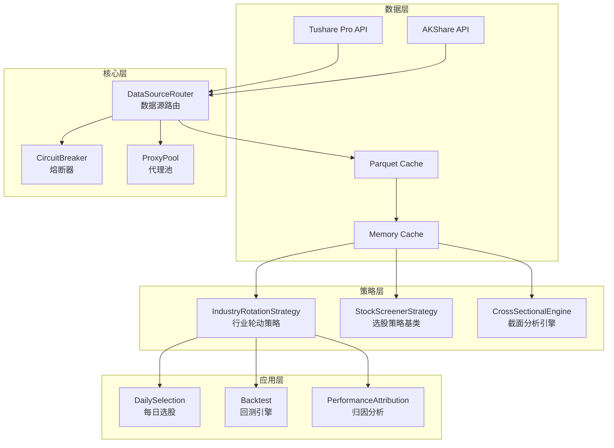
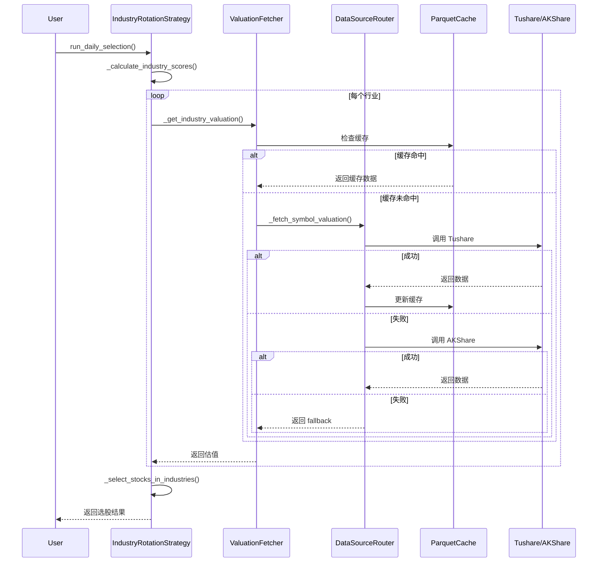

# VNPY Alpha 系统架构文档

> **版本**: 1.0.0  
> **最后更新**: 2026-06-21  
> **作者**: Atlas (Chief Architect AI)

---

## 📐 架构概览



---

## 🏛️ 分层架构详解

### 1. 数据层 (Data Layer)

**职责**: 管理外部数据源和本地缓存

#### 1.1 数据源
- **Tushare Pro**: 主数据源，提供财务数据、行情数据
- **AKShare**: 备用数据源，开源免费
- **本地缓存**: Parquet 文件 + 内存缓存

#### 1.2 缓存策略
```
查询流程:
1. 内存缓存 (最快，~1ms)
2. Parquet 缓存 (本地，~50ms)
3. Tushare API (网络，~500ms)
4. AKShare API (备用，~800ms)
5. 硬编码 Fallback (兜底)
```

**缓存更新策略**:
- 内存缓存: 进程生命周期内有效
- Parquet 缓存: 每日收盘后更新
- TTL: 24小时自动过期

### 2. 核心层 (Core Layer)

**职责**: 提供基础设施服务

#### 2.1 DataSourceRouter (数据源路由)
```python
class DataSourceRouter:
    """多数据源自动路由和故障转移"""
    
    def fetch(self, symbol: str, data_type: str) -> Any:
        # 1. 尝试主数据源
        try:
            return self.tushare.fetch(symbol, data_type)
        except Exception as e:
            self.circuit_breaker.record_failure('tushare')
        
        # 2. 尝试备用数据源
        try:
            return self.akshare.fetch(symbol, data_type)
        except Exception as e:
            self.circuit_breaker.record_failure('akshare')
        
        # 3. 返回缓存或 fallback
        return self.cache.get(symbol, data_type, default=FALLBACK)
```

**关键特性**:
- 自动故障转移
- 熔断器保护
- 代理池支持
- 请求限流

#### 2.2 CircuitBreaker (熔断器)
```python
class CircuitBreaker:
    """防止级联故障"""
    
    states = ['CLOSED', 'OPEN', 'HALF_OPEN']
    
    def __init__(self, failure_threshold=3, recovery_timeout=300):
        self.failure_count = 0
        self.failure_threshold = failure_threshold
        self.recovery_timeout = recovery_timeout
        self.state = 'CLOSED'
    
    def record_failure(self):
        self.failure_count += 1
        if self.failure_count >= self.failure_threshold:
            self.state = 'OPEN'
    
    def can_execute(self) -> bool:
        if self.state == 'CLOSED':
            return True
        elif self.state == 'OPEN':
            if time.time() - self.last_failure > self.recovery_timeout:
                self.state = 'HALF_OPEN'
                return True
        return False
```

#### 2.3 ProxyPool (代理池)
```python
class ProxyPool:
    """管理代理 IP 池"""
    
    def get_proxy(self) -> Optional[str]:
        """获取可用代理"""
        for proxy in self.proxies:
            if self.is_healthy(proxy):
                return proxy
        return None
    
    def report_failure(self, proxy: str):
        """报告代理失败"""
        self.failure_count[proxy] += 1
        if self.failure_count[proxy] > 3:
            self.remove(proxy)
```

### 3. 策略层 (Strategy Layer)

**职责**: 实现交易策略逻辑

#### 3.1 IndustryRotationStrategy (行业轮动策略)

**核心算法**:
```python
def _calculate_industry_scores(self, industry: str) -> Dict[str, float]:
    """计算行业综合得分"""
    
    # 1. 动量评分 (40%)
    momentum_score = self._calculate_momentum(industry) * 0.4
    
    # 2. 估值评分 (30%)
    valuation = self._get_industry_valuation(industry)
    valuation_score = self._score_valuation(valuation) * 0.3
    
    # 3. 资金流评分 (20%)
    capital_flow_score = self._calculate_capital_flow(industry) * 0.2
    
    # 4. 波动率评分 (10%)
    volatility_score = (1 - self._calculate_volatility(industry)) * 0.1
    
    total_score = (
        momentum_score + 
        valuation_score + 
        capital_flow_score + 
        volatility_score
    )
    
    return {
        'momentum': momentum_score,
        'valuation': valuation_score,
        'capital_flow': capital_flow_score,
        'volatility': volatility_score,
        'total': total_score
    }
```

**关键方法**:
- `_calculate_industry_scores()`: 计算行业综合得分
- `_select_stocks_in_industries()`: 行业内选股
- `_get_industry_valuation()`: 获取行业估值
- `_calculate_industry_turnover()`: 计算行业换手率

#### 3.2 StockScreenerStrategy (选股策略基类)

```python
class StockScreenerStrategy:
    """选股策略抽象基类"""
    
    def screen_stocks(self, universe: List[str]) -> List[str]:
        """筛选股票"""
        raise NotImplementedError
    
    def calculate_score(self, stock: str) -> float:
        """计算股票得分"""
        raise NotImplementedError
    
    def should_rebalance(self) -> bool:
        """是否需要调仓"""
        raise NotImplementedError
```

**派生策略**:
- `ValueStockStrategy`: 价值股策略
- `GrowthStockStrategy`: 成长股策略
- `QualityStockStrategy`: 质量股策略
- `DividendStockStrategy`: 高股息策略

#### 3.3 CrossSectionalEngine (截面分析引擎)

```python
class CrossSectionalEngine:
    """截面回测引擎"""
    
    def __init__(self, config: Dict):
        self.limit_up_down = config.get('limit_up_down', True)
        self.t_plus_1 = config.get('t_plus_1', True)
        self.liquidity_filter = config.get('liquidity_filter', True)
        self.slippage = config.get('slippage', 0.001)
    
    def run_backtest(self, strategy: Strategy, data: pd.DataFrame) -> BacktestResult:
        """运行回测"""
        # 1. 加载数据
        # 2. 应用涨跌停限制
        # 3. 应用 T+1 限制
        # 4. 应用流动性过滤
        # 5. 计算滑点
        # 6. 生成交易信号
        # 7. 计算收益
        pass
```

### 4. 应用层 (Application Layer)

**职责**: 提供用户接口和高级功能

#### 4.1 DailySelection (每日选股)
```python
def run_daily_selection():
    """每日选股流程"""
    # 1. 检查数据新鲜度
    check_data_freshness()
    
    # 2. 加载股票池
    universe = load_stock_universe()
    
    # 3. 运行策略
    strategy = IndustryRotationStrategy()
    selected = strategy.screen_stocks(universe)
    
    # 4. 生成交易计划
    plan = generate_trade_plan(selected)
    
    # 5. 同步到飞书
    sync_to_feishu(plan)
```

#### 4.2 Backtest (回测引擎)
```python
class BacktestEngine:
    """回测引擎"""
    
    def __init__(self, start_date: str, end_date: str, initial_capital: float):
        self.start_date = start_date
        self.end_date = end_date
        self.initial_capital = initial_capital
    
    def run(self, strategy: Strategy) -> BacktestResult:
        """运行回测"""
        # 1. 加载历史数据
        # 2. 初始化账户
        # 3. 逐日模拟交易
        # 4. 计算绩效指标
        # 5. 生成报告
        pass
```

#### 4.3 PerformanceAttribution (归因分析)
```python
class PerformanceAttribution:
    """绩效归因分析"""
    
    def analyze(self, portfolio: Portfolio, benchmark: Benchmark) -> AttributionResult:
        """分析收益来源"""
        # 1. 计算超额收益
        # 2. 行业归因
        # 3. 个股归因
        # 4. 因子归因
        # 5. 生成报告
        pass
```

---

## 🔄 数据流详解

### 行业轮动策略数据流



### 估值数据获取流程

```
1. 检查内存缓存
   ↓ (miss)
2. 检查 Parquet 缓存
   ↓ (miss)
3. 调用 ValuationFetcher._fetch_symbol_valuation()
   ├── 尝试 Tushare API
   │   ├── 成功 → 更新缓存 → 返回
   │   └── 失败 → 记录熔断
   ├── 尝试 AKShare API
   │   ├── 成功 → 更新缓存 → 返回
   │   └── 失败 → 记录熔断
   └── 使用硬编码 fallback (PE=15, PB=2, div=1.5)
       └── 记录 warning 日志
   ↓
4. 计算行业平均估值
   ↓
5. 返回 (PE, PB, dividend_yield, source)
```

---

## 🔐 安全架构

### 1. API Token 管理
```python
# 从环境变量读取，不硬编码
TUSHARE_TOKEN = os.getenv('TUSHARE_TOKEN')
if not TUSHARE_TOKEN:
    raise ValueError("TUSHARE_TOKEN not set")
```

### 2. 数据验证
```python
# 输入验证
def process_data(data: Dict) -> Dict:
    if not isinstance(data, dict):
        raise ValueError("Expected dict")
    if 'price' not in data:
        raise KeyError("Missing 'price' field")
    if data['price'] <= 0:
        raise ValueError("Price must be positive")
    return data
```

### 3. 异常处理
```python
# 明确的 fallback + 日志
try:
    result = fetch_data()
except Exception as e:
    logger.warning(f"Data fetch failed: {e}, using fallback")
    result = DEFAULT_VALUE
```

---

## 📊 性能优化

### 1. 缓存策略
- **内存缓存**: 进程生命周期内有效
- **Parquet 缓存**: 持久化存储，每日更新
- **TTL 机制**: 24小时自动过期

### 2. 批量处理
```python
# 批量获取数据，减少 API 调用
def fetch_multiple_valuations(symbols: List[str]) -> Dict:
    # 一次 API 调用获取多个 symbol
    return api.fetch_batch(symbols)
```

### 3. 异步处理
```python
# 使用 asyncio 并行获取数据
import asyncio

async def fetch_all(symbols: List[str]) -> Dict:
    tasks = [fetch_symbol(s) for s in symbols]
    return await asyncio.gather(*tasks)
```

---

## 🧪 测试策略

### 1. 单元测试
```python
def test_safe_float():
    assert safe_float('12.5') == 12.5
    assert safe_float('nan') is None
    assert safe_float(float('inf')) is None
```

### 2. 集成测试
```python
def test_industry_rotation():
    strategy = IndustryRotationStrategy()
    result = strategy.screen_stocks(universe)
    assert len(result) > 0
```

### 3. 性能测试
```python
def test_performance():
    start = time.time()
    strategy.run_backtest()
    duration = time.time() - start
    assert duration < 5.0  # 5秒内完成
```

---

## 📈 扩展性设计

### 1. 策略扩展
```python
# 继承基类实现新策略
class MyCustomStrategy(StockScreenerStrategy):
    def screen_stocks(self, universe):
        # 实现自定义逻辑
        pass
```

### 2. 数据源扩展
```python
# 实现新的数据源适配器
class NewDataSource:
    def fetch(self, symbol, data_type):
        # 实现数据获取逻辑
        pass
```

### 3. 插件系统
```python
# 支持插件扩展功能
class PluginManager:
    def load_plugin(self, plugin_name: str):
        # 动态加载插件
        pass
```

---

## 🚀 部署架构

### 单机部署
```
┌─────────────────────────────────────┐
│         VNPY Alpha System           │
├─────────────────────────────────────┤
│  Cron Scheduler                     │
│  ├── 09:00 数据更新                 │
│  ├── 14:30 策略运行                 │
│  └── 15:30 报告生成                 │
├─────────────────────────────────────┤
│  Strategy Engine                    │
│  ├── IndustryRotation               │
│  ├── StockScreener                  │
│  └── Backtest                       │
├─────────────────────────────────────┤
│  Data Layer                         │
│  ├── Tushare/AKShare                │
│  ├── Parquet Cache                  │
│  └── Memory Cache                   │
└─────────────────────────────────────┘
```

### 分布式部署（未来）
```
┌──────────────┐     ┌──────────────┐
│  Scheduler   │────▶│  Strategy    │
│   Node       │     │   Node 1     │
└──────────────┘     └──────────────┘
         │                    │
         ▼                    ▼
┌──────────────┐     ┌──────────────┐
│  Data Node   │     │  Strategy    │
│              │     │   Node 2     │
└──────────────┘     └──────────────┘
```

---

## 📚 参考资料

- [VNPY 官方文档](https://www.vnpy.com/docs/)
- [Tushare API 文档](https://tushare.pro/document/2)
- [AKShare 文档](https://akshare.akfamily.xyz/)

---

**最后更新**: 2026-06-21 by Atlas
